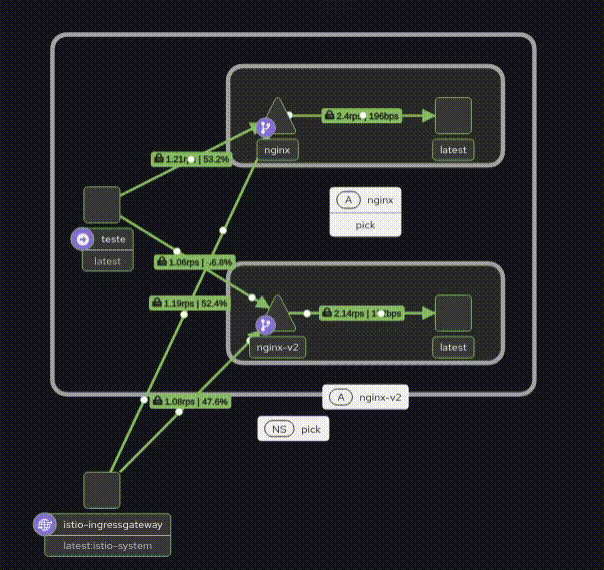

# pick-2026

## Day 2 - Service Mesh

This setup demonstrates Istio traffic management using two versions of an application (`nginx` and `nginx-v2`). Nginx is used as the application server, while Istio injects an Envoy sidecar proxy into each application pod to handle and control network traffic. The sidecar proxies allow Istio to manage communication between services without requiring changes to the application itself.

A virtual service is configured to distribute traffic between the two application versions with a 50/50 split. External traffic enters the cluster through the Istio Ingress Gateway, which uses Envoy to route requests into the mesh, while internal traffic between services is also handled by the Envoy sidecars. This demonstrates how Istio can apply consistent traffic routing to both ingress and service-to-service communication.

Prometheus is used to collect metrics from the service mesh, while Kiali is used to provide a visual representation of the services and traffic flow.

The configuration simulates a basic canary deployment, where traffic can be gradually distributed between different versions of an application.

The resulting traffic flow through the service mesh can be seen in the image below.

    

